# MATHO — Architecture Guide

This document explains the Phase 1 foundation architecture: why it's shaped
this way, and where future business logic will attach. Eleven diagrams cover
structure, flows, and deployment.

## Principles

Clean Architecture, Domain-Driven Design boundaries, SOLID, a modular
monorepo, and mobile-first, Pi-native UX. Concretely, that means:

- **Apps depend on packages, never the reverse.** `apps/web`, `apps/admin`,
  and `apps/api` all consume `packages/*`; no package imports from `apps/*`.
- **The UI package has zero framework lock-in beyond React.** It never
  imports `next/link` or Nest decorators, so it can be reused by any future
  React surface (e.g. a native shell) without modification.
- **The streaming and payment vendors are never hardcoded.** `packages/sdk`
  defines interfaces; concrete providers are swapped via configuration.
- **One Prisma schema, one source of truth.** `packages/types` mirrors it at
  the type level so the frontend never needs the Prisma client directly.

---

## 1. Overall monorepo structure

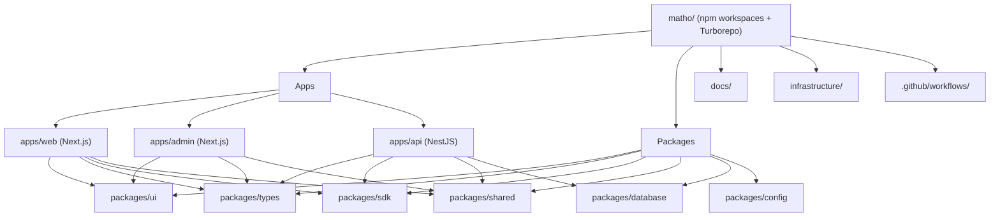

## 2. Clean Architecture layers (apps/api)

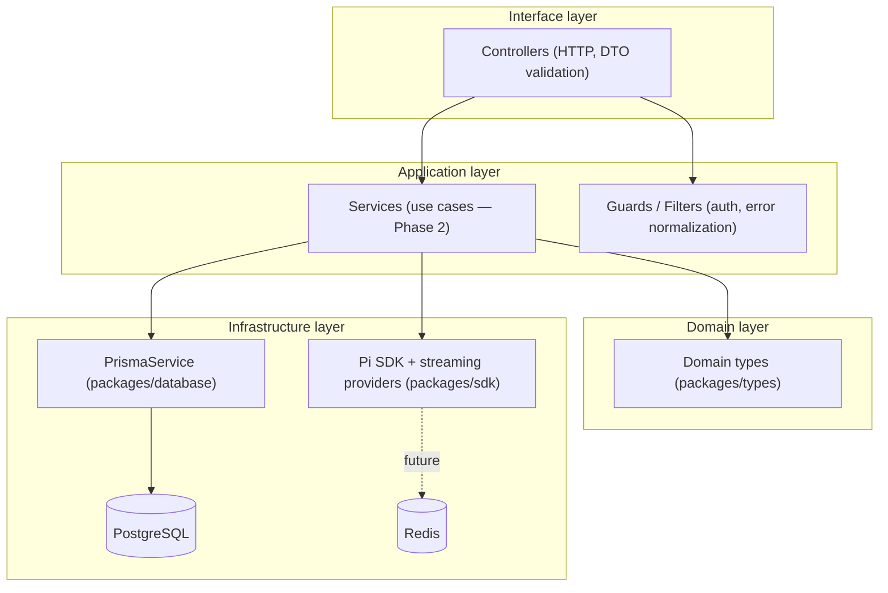

## 3. Folder hierarchy

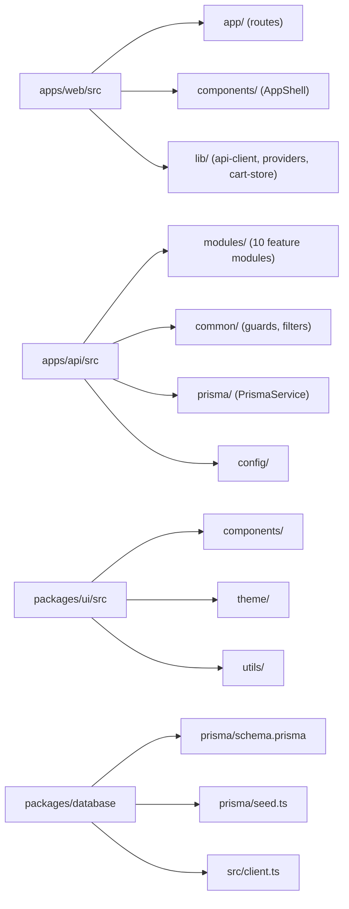

## 4. Authentication flow (target design, Phase 2)

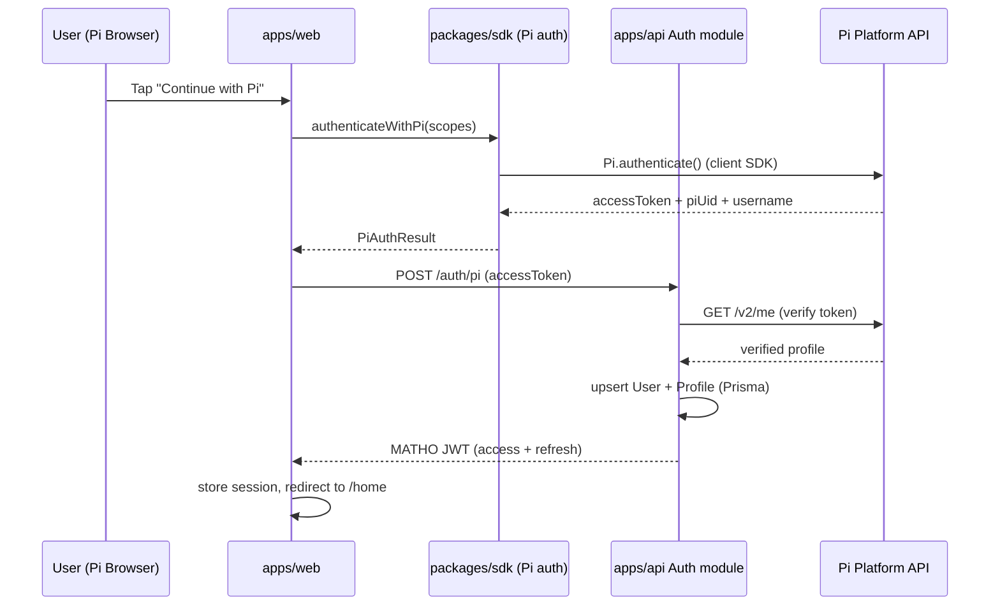

## 5. Pi SDK placeholder flow (current, Phase 1)

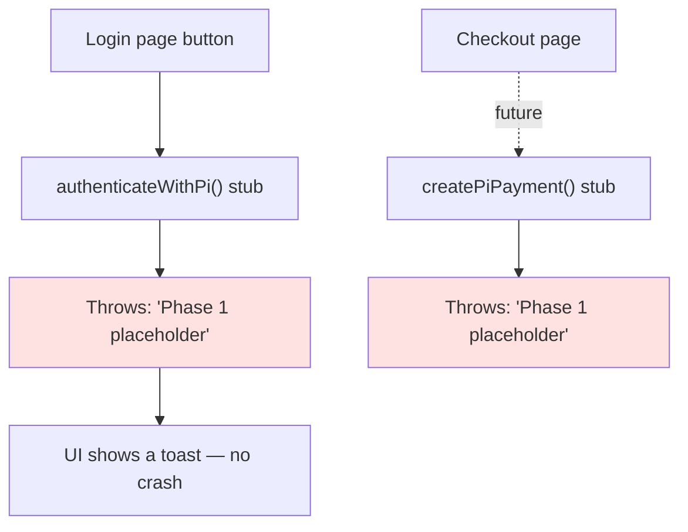

## 6. Frontend routing (apps/web)

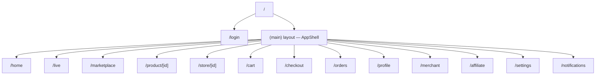

## 7. Backend modules (apps/api)

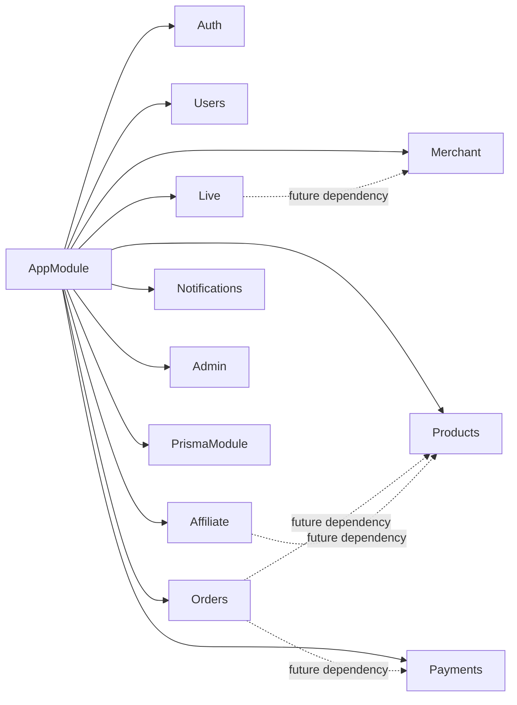

## 8. Database ER diagram

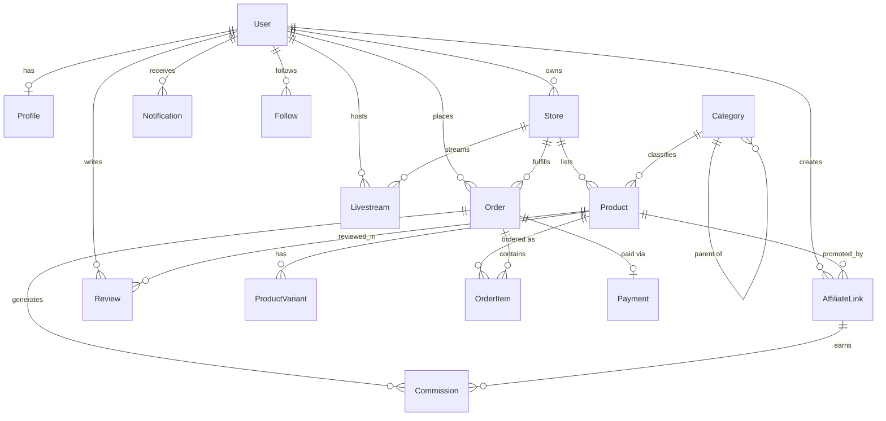

## 9. Deployment architecture

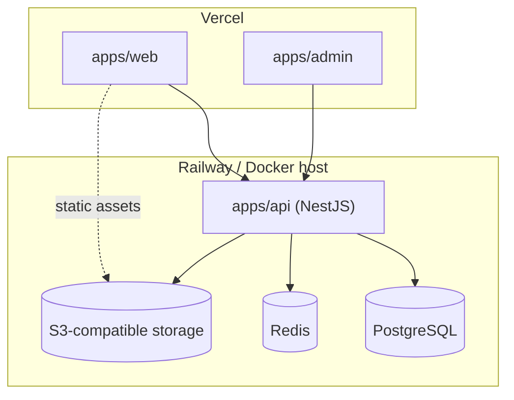

## 10. CI/CD pipeline

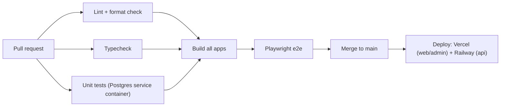

## 11. Future microservices architecture

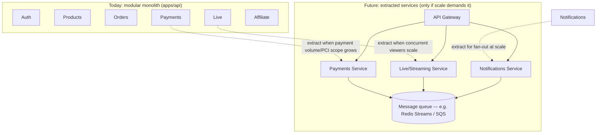

---

## Why these choices (and what we rejected)

- **npm workspaces + Turborepo**, not Nx or Lerna: Turborepo's task caching
  is enough for this repo's size, and npm workspaces avoids a second package
  manager. Nx's plugin system is more than Phase 1 needs.
- **NestJS**, not raw Express: the module system maps directly onto DDD
  bounded contexts (Auth, Products, Orders, ...) and gives us DI, guards, and
  OpenAPI generation for free — all of which a hand-rolled Express app would
  need to reinvent.
- **Prisma over TypeORM**: stronger TypeScript inference, simpler migrations,
  and a schema that doubles as living documentation of the domain.
- **A provider-agnostic streaming interface from day one**: live commerce is
  the platform's core differentiator, and locking into one vendor before
  Phase 1 even ships would be a costly mistake to unwind later.
- **UI package with no Next.js imports**: keeps the design system portable
  and testable in isolation (Vitest + Testing Library), independent of any
  one app's routing.
